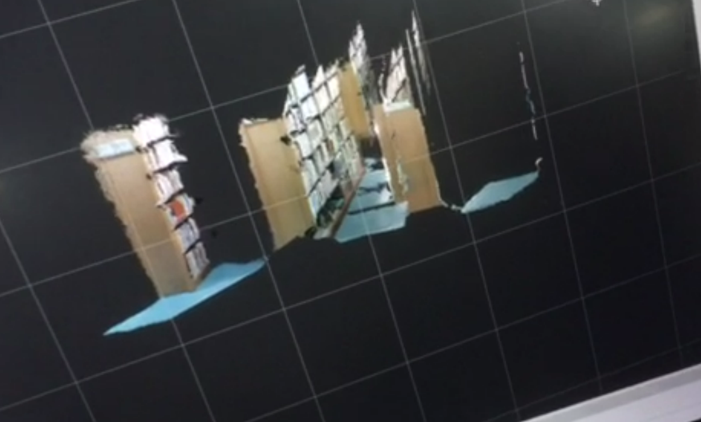

##  0.ElasticFusion

使用realsense D435i相机运行。如有帮助到您，点个赞啊.




## 1.install


- [安装参考0.ElasticFusion编译过程（Ubuntu16.04）](https://blog.csdn.net/jthree2012/article/details/80837661)
- [安装参考1.Ubuntu18.04+realsense运行ElasticFusion](https://blog.csdn.net/dongzid/article/details/85906109)
- [安装参考2.Ubuntu16.04+realsense运行ElasticFusion](https://blog.csdn.net/u010497704/article/details/89490675)


##  2.run

```bash
source devel/setup.bash
roslaunch elastic_bridge ElasticFusionRealsense.launch
```

笔记本跑的，性能不够，跑到后面就会卡死。


